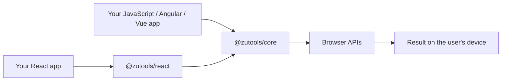

<div align="center">

# ZU Tools

**Local-first utilities for files and data. No login, no uploads, no server-side processing.**

[](https://github.com/usezutools/zutools/actions/workflows/ci.yml)
[](https://www.npmjs.com/package/@zutools/core)
[](https://www.npmjs.com/package/@zutools/react)
[](LICENSE)

</div>

ZU Tools is an open-source collection of browser tools and reusable JavaScript
engines. Use one small function, embed one React tool, or add the complete tools
catalogue to an existing application.

> [!NOTE]
> ZU Tools follows semantic versioning and is currently in the `0.x` series.
> Public APIs may evolve between minor releases; use only declared package
> exports and review the changelog when upgrading.

## Why ZU Tools?

- **Local-first:** input is processed on the user's device.
- **Privacy-friendly:** the library does not upload files or require an account.
- **Framework-optional:** the engines work without React or any UI framework.
- **Composable:** import one capability instead of the entire catalogue.
- **Typed:** published packages include TypeScript declarations and source maps.
- **Open source:** ZU Tools code is available under the MIT license.

## Choose how you want to use it

| You want to… | Install | Import |
|---|---|---|
| Use logic from JavaScript, TypeScript, Angular, Vue, Svelte or a Web Worker | `@zutools/core` | `@zutools/core/<capability>` |
| Render one ready-made React tool | `@zutools/core`, `@zutools/react` | `@zutools/react/<tool>` |
| Embed the complete React catalogue | `@zutools/core`, `@zutools/react` | `@zutools/react/portal` |
| Read the catalogue without running JavaScript | `@zutools/core` | `@zutools/core/catalog.json` |

The recommended approach is the narrowest import that meets your needs. It
makes dependencies explicit and produces the smallest bundle.

## Quick start

### JavaScript or TypeScript

Install the framework-independent package:

```bash
npm install @zutools/core
```

Import only the engine you need:

```js
import { analyzeText } from '@zutools/core/word-counter';

const metrics = analyzeText('ZU Tools keeps this text in your browser.', {
  locale: 'en',
  wordsPerMinute: 200,
});

console.log(metrics.words);
console.log(metrics.readingTimeSeconds);
```

The same imports work in JavaScript and TypeScript. Types are discovered
automatically.

### React: one tool

Use an individual entry when your screen only needs one ready-made tool:

```bash
npm install @zutools/core @zutools/react lucide-react
```

```jsx
import { WordCounter } from '@zutools/react/word-counter';
import '@zutools/react/word-counter.css';

export default function WritingPage() {
  return <WordCounter language="en" />;
}
```

Your project must already use React 18.2 or newer. The individual Word Counter
currently adds approximately **1.1 kB gzip of ZU Tools JavaScript** and **885 B
gzip of CSS**, excluding peer dependencies.

### React: complete catalogue

Use the portal entry when you want the searchable catalogue and all registered
tool interfaces:

```jsx
import {
  ToolsPortal,
  portalCatalog,
  portalRegistry,
} from '@zutools/react/portal';
import '@zutools/react/styles.css';

export default function ToolsPage() {
  return (
    <ToolsPortal
      language="en"
      catalog={portalCatalog}
      registry={portalRegistry}
    />
  );
}
```

### Angular

Angular does not need the React package. Put the framework-independent engine
behind an Angular service and use it from any component:

```bash
npm install @zutools/core
```

```ts
import { Injectable } from '@angular/core';
import {
  analyzeText,
  type TextAnalysis,
} from '@zutools/core/word-counter';

@Injectable({ providedIn: 'root' })
export class TextAnalysisService {
  analyze(text: string, locale = 'en'): TextAnalysis {
    return analyzeText(text, { locale });
  }
}
```

```ts
import { Component, inject } from '@angular/core';
import { TextAnalysisService } from './text-analysis.service';

@Component({
  selector: 'app-editor-stats',
  standalone: true,
  template: `
    <textarea #editor (input)="update(editor.value)"></textarea>
    <p>{{ words }} words</p>
  `,
})
export class EditorStatsComponent {
  private readonly textAnalysis = inject(TextAnalysisService);
  words = 0;

  update(text: string) {
    this.words = this.textAnalysis.analyze(text).words;
  }
}
```

This pattern also applies to Vue, Svelte, Solid and other frameworks: keep the
engine in `@zutools/core` and build the UI with the framework you already use.

## Run the examples

The repository includes two permanent Vite applications. Both install freshly
generated package tarballs, so they exercise the same files that npm users will
receive rather than importing monorepo source code.

```bash
# Vanilla JavaScript: Word Counter, JSON and Base64
npm run example:vanilla

# React: isolated tool and complete catalogue
npm run example:react

# Build both examples without starting a server
npm run examples:test
```

Explore [`examples/vanilla`](examples/vanilla) and
[`examples/react`](examples/react) for complete, copyable projects.

## Available tools

The catalogue currently contains 15 working browser tools:

| Area | Tools |
|---|---|
| Images | Resize image, WebP to PNG/JPG, PNG to JPG, JPG to PNG |
| Data | JSON formatter, JSON ↔ CSV, Base64, Unix timestamp converter |
| Text | Case converter, Word Counter, Text Diff Checker |
| Privacy | Image metadata remover |
| PDF (beta) | Merge PDF, Organize PDF, Split PDF |

The executable source of truth is
[`packages/core/catalog/tools.json`](packages/core/catalog/tools.json). A tool
is only included in the public catalogue after its engine, interface and tests
exist.

PDF merge leaves document Info/XMP metadata blank. PDF processing runs locally,
keeps the originals unchanged and verifies each result before download.

## Core API

`@zutools/core` is ESM and independent of React. PDF processing assets are
loaded only when needed. Prefer capability entries over the root barrel:

| Entry | Main capabilities |
|---|---|
| `@zutools/core/base64` | UTF-8, bytes, `ArrayBuffer`, Base64 and Data URIs |
| `@zutools/core/csv` | Parse CSV and convert CSV ↔ JavaScript objects |
| `@zutools/core/json` | Parse, validate, format and minify JSON |
| `@zutools/core/text` | Uppercase, lowercase, title, camel, snake and kebab case |
| `@zutools/core/timestamp` | Convert Unix seconds/milliseconds and JavaScript dates |
| `@zutools/core/word-counter` | Words, graphemes, sentences, paragraphs and reading time |
| `@zutools/core/text-diff` | Compare text with Smart, word, line or character precision and numbered rows; Smart falls back to lines for large inputs |
| `@zutools/core/image` | Load images, render Canvas and create `Blob` output |
| `@zutools/core/image-metadata` | Read local EXIF, PNG and WebP metadata |
| `@zutools/core/pdf` | Local PDF merge, organize, split and inspection |
| `@zutools/core/pdf-preview` | Optional local thumbnail sessions |
| `@zutools/core/catalog` | Typed catalogue, selectors and validation |
| `@zutools/core/catalog.json` | Raw catalogue JSON |

<details>
<summary><strong>More Core examples</strong></summary>

#### JSON

```js
import { formatJson, isValidJson, minifyJson } from '@zutools/core/json';

formatJson('{"ready":true}');
minifyJson({ ready: true });
isValidJson('{"ready":true}');
```

#### CSV

```js
import { csvToObjects, objectsToCsv } from '@zutools/core/csv';

const rows = csvToObjects('name,score\nAda,10', ',', { inferTypes: true });
const csv = objectsToCsv(rows);
```

#### Base64

```js
import { base64ToUtf8, utf8ToBase64 } from '@zutools/core/base64';

const encoded = utf8ToBase64('Hello 👋');
const decoded = base64ToUtf8(encoded);
```

#### Unix timestamps

```js
import { dateToUnix, timestampToDate } from '@zutools/core/timestamp';

const date = timestampToDate(1_700_000_000);
const { seconds, milliseconds } = dateToUnix(date);
```

</details>

## React API

### `ToolsPortal` props

| Prop | Default | Purpose |
|---|---|---|
| `language` | `"es"` | Interface language: `"es"` or `"en"` |
| `catalog` | Complete catalogue | Catalogue to display |
| `registry` | Default registry | Maps tool IDs to React implementations |
| `featuredToolIds` | Built-in selection | Controls the featured tools section |
| `brandLabel` | `"ZU Tools"` | Label displayed above featured tools |
| `className` | `""` | Adds a class to the portal root |
| `requestedToolId` | `null` | Opens a tool from external application state |
| `onToolOpen` | — | Receives `(tool, { implemented })` |
| `onToolClose` | — | Receives the tool being closed |

```jsx
<ToolsPortal
  language="en"
  brandLabel="Utilities"
  requestedToolId="word-counter"
  onToolOpen={(tool) => console.log('Opened', tool.id)}
  onToolClose={(tool) => console.log('Closed', tool?.id)}
/>
```

### Styling and theming

The React package ships plain CSS. Import it once at your application entry and
override the exposed custom properties from your own stylesheet:

```css
.my-tools {
  --zutools-text: #102a43;
  --zutools-muted: #627d98;
  --zutools-accent: #4fd1c5;
}
```

```jsx
<ToolsPortal className="my-tools" language="en" />
```

Available stylesheets:

| Import | Use case |
|---|---|
| `@zutools/react/styles.css` | Complete portal and all tool workspaces |
| `@zutools/react/workspace.css` | Tool implementations without the catalogue shell |
| `@zutools/react/word-counter.css` | Isolated Word Counter only |
| `@zutools/react/text-diff-checker.css` | Isolated Text Diff Checker only |

## Architecture



```text
packages/core/     @zutools/core  — engines, types and catalogue
packages/react/    @zutools/react — React components and styles
```

`@zutools/react` delegates transformations to `@zutools/core`; it does not keep
copies of the engines. Published packages contain compiled ESM, source maps,
TypeScript declarations, CSS and the required catalogue assets from `dist/`.

## Privacy model

ZU Tools does not require login credentials and its transformation engines do
not make network requests. Files and text passed to the current tools stay in
the browser process.

> [!NOTE]
> ZU Tools cannot control the rest of the host application. If your application
> uploads input, adds telemetry around it or forwards results elsewhere, that is
> outside the library's privacy boundary.

Image operations rely on browser APIs such as Canvas. Functions that use DOM
types must therefore run in a browser context, while text and data engines can
also run in Node.js or Web Workers when the required globals are available.

## Tree-shaking and bundle budgets

Individual exports are tested by installing the real npm tarballs in a temporary
consumer and bundling them with esbuild. React, React DOM, Lucide and Core are
externalized consistently so the comparison measures ZU Tools code only.

| Consumer | JavaScript gzip | CSS gzip |
|---|---:|---:|
| `@zutools/core/word-counter` | 708 B | — |
| `@zutools/react/word-counter` | 1.1 kB | 885 B |
| `@zutools/core/text-diff` | 3.9 kB | — |
| `@zutools/react/text-diff-checker` | 4.2 kB | 2.5 kB |
| Complete React portal | 25.9 kB | 10.5 kB |

CI fails when a measured bundle grows beyond the committed tolerance. See
[`benchmarks/README.md`](benchmarks/README.md) for the update procedure.

## Development

Requirements: Node.js 22 or 24 and npm.

```bash
npm ci                         # Reproduce the locked dependency tree
npm run build                  # Compile Core and React into dist/
npm test                       # Build and run package tests
npm run validate               # Validate catalogue references
npm run licenses:check         # Enforce the approved dependency licenses
npm run pack:check             # Inspect publishable package contents
npm run test:tarballs          # Install tarballs in external test projects
npm run examples:test          # Build the permanent Vanilla and React examples
npm run measure:tree-shaking   # Enforce the committed bundle limits
```

Only update the bundle baseline after reviewing an intentional increase:

```bash
npm run measure:tree-shaking:update
```

GitHub Actions runs builds and tests on Node.js 22 and 24 for every pull request
and every push to `main`. A second job checks publishable tarballs, external
consumers, dependency security and tree-shaking limits. Dependabot checks npm
and GitHub Actions weekly; normal major upgrades are deliberately excluded.

## Tests

| Layer | Location | What it protects |
|---|---|---|
| Core unit tests | `packages/core/src/*.test.mjs` | Transformation behaviour and edge cases |
| Compiled React import | `packages/react/package.json` | Public compiled modules resolve correctly |
| Catalogue validation | `packages/core/scripts/validate-catalog.mjs` | IDs and categories remain coherent |
| Tarball consumers | `scripts/test-tarballs.mjs` | JavaScript, React, CSS and strict TypeScript usage |
| Runnable examples | `examples/vanilla`, `examples/react` | Copyable integrations built from package tarballs |
| Bundle measurement | `scripts/measure-tree-shaking.mjs` | Individual imports stay smaller than the portal |

## Package documentation

- [`@zutools/core`](packages/core/README.md)
- [`@zutools/react`](packages/react/README.md)
- [Bundle measurement](benchmarks/README.md)
- [Contributing](CONTRIBUTING.md)
- [Security policy](SECURITY.md)
- [Release process](RELEASING.md)
- [Changelog](CHANGELOG.md)
- [Third-party notices](THIRD_PARTY_NOTICES.md)

## Contributing

Each new tool should be implemented vertically:

1. Define the expected behavior and representative acceptance fixtures.
2. Add framework-independent processing in `@zutools/core`.
3. Add unit tests and public types.
4. Add the optional React interface.
5. Export the tool through an individual entry.
6. Test the real tarball and measure its bundle impact.

Please run `npm test`, `npm run validate`, `npm run test:tarballs` and
`npm run measure:tree-shaking` before opening a pull request.

## License

ZU Tools original code is released under the [MIT License](LICENSE). Third-party
dependencies retain their respective licenses.
